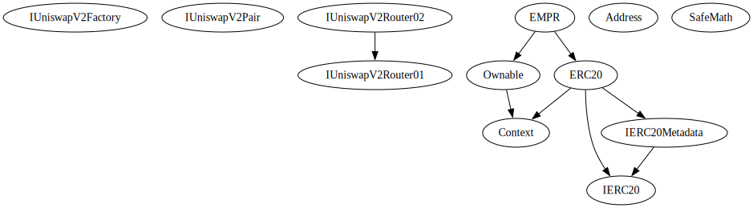

# Elon Musk Pamp Rocket Ship smart contract audit report

## Overview

The Expelee team has performed a line-by-line manual analysis and automated review of the smart contract. The smart contract was analysed mainly for common smart contract vulnerabilities, exploits, and manipulation hacks. According to the smart contract audit:

|   Audit Result   | Not passed |
|:----------------:|:----------:|
| KYC Verification |     -      |
|    Audit Date    | 4 May 2023 |


## Contract Summery

The EMPR contract is a smart contract written in Solidity programming language. It is an ERC20 token that inherits from the ERC20 and Ownable contracts. The contract also uses the IUniswapV2Router02 interface to interact with the Uniswap decentralized exchange.

The contract has several functionalities such as:

1. Automatic liquidity provision: When a trade occurs, a percentage of the transaction value is added to the contract's liquidity pool on the Uniswap exchange.
2. Automatic marketing fee collection: When a trade occurs, a percentage of the transaction value is sent to the marketing wallet.
3. Blacklisting: The contract allows the owner to blacklist specific addresses to prevent them from using the token.
4. Max transaction limit: The contract allows the owner to set a maximum limit for the amount of tokens that can be traded in a single transaction.
5. Max wallet limit: The contract allows the owner to set a maximum limit for the amount of tokens that can be held in a single wallet.

The contract also has some other functionalities such as the ability to burn tokens, exclude specific addresses from fees, and claim stuck tokens.

## Contract Details

Token Name: EMPR

Token Symbol: Elon Musk Pamp Rocketship

Network: Binance Smart Chain

Language: solidity

Contract address: -

Total Supply: 

BSC Pancake Mainnet Router(Mainnet - 56): 0x10ED43C718714eb63d5aA57B78B54704E256024E

BSC Pancake Mainnet Router(Testnet - 97): 0xD99D1c33F9fC3444f8101754aBC46c52416550D1

ETH Uniswap Router(Mainnet - 1 & Goerli Testnet - 5): 0x7a250d5630B4cF539739dF2C5dAcb4c659F2488D

Marketing Wallet: 0x61Dd481A114A2E761c554B641742C973867899D3

PinkLock: 0x407993575c91ce7643a4d4cCACc9A98c36eE1BBE


## Owner Privileges

1. Ability to change the marketing wallet address using the `changeMarketingWallet` function.
2. Ability to enable trading and swap using the `enableTrading` and `setSwapEnabled` functions, respectively.
3. Ability to set the maximum transaction amount for buys and sells, as well as the maximum wallet amount using the `setMaxTransactionAmounts` and `setMaxWalletAmount` functions.
4. Ability to exclude and include specific accounts from the maximum transaction and maximum wallet limit using the `excludeFromMaxWallet` and `excludeFromMaxTxLimit` functions.
5. Ability to burn tokens using the `burn` function.
6. Ability to exclude and include specific accounts from fees using the `excludeFromFees` function.
7. Ability to change the buy and sell fees using the `updateBuyFees` and `updateSellFees` functions.
8. Ability to set whether or not the maximum transaction and maximum wallet limit is enabled using the `setEnableMaxTransactionLimit` and `setEnableMaxWalletLimit` functions, respectively.
9. Ability to claim stuck tokens or ETH in the contract using the `claimStuckTokens` function.
10. Ability to set the amount of tokens needed to trigger a swap using the `setSwapTokensAtAmount` function.
11. Ability to add and remove addresses to/from the blacklist using the `addBlacklist` function.
12. Ability to enable and disable the blacklist using the `setBlackListEnabled` function.


## Audit Methodology

### Audit Details

Our comprehensive audit report provides a full overview of the audited system's architecture, smart contract codebase, and details on any vulnerabilities found within the system.

### Audit Goals

The audit goal is to ensure that the project is built to protect investors and users, preventing potentially catastrophic vulnerabilities after launch , that lead to scams and rugpulls.

### Code Quality

Our analysis includes both automatic tests and manual code analysis for the following aspects:

- Exploits 
- Back-doors 
- Vulnerability 
- Accuracy 
- Readability

### Tools
- DE
- Openzeppelin
- Code Analyzer
- Compiler
- Hardhat
- Slither
- Solidity visual developer

## Vulnerability Checks

|                             Type                             |   Result   |
|:------------------------------------------------------------:|:----------:|
|                         Design Logic                         | Not Passed |
|                      Compiler warnings                       |   Passed   |
|                   Private user data leaks                    |   Passed   |
|                    Timestamps dependence                     |   Passed   |
|                Integer overflow and underflow                |   Passed   |
| Race conditions & reentrancy. Cross-function race conditions | Not Passed |
|               Possible delays in data delivery               |   Passed   |
|                         Oracle calls                         |   Passed   |
|                        Front Running                         |   Passed   |
|                Methods execution permissions                 |   Passed   |
|                        Economy model                         |   Passed   |
|                   Scoping and declarations                   |   Passed   |
|                Uninitialized storage pointers                |   Passed   |
|                     Arithmatic accuracy                      | Not Passed |


## Risk Classification

When performing smart contract audits, our specialists look for known vulnerabilities as well as logical and acces control issues within the code. The exploitation of these issues by malicious actors may cause serious financial damage to projects that failed to get an audit in time. We categorize these vulnerabilities by the following levels:

### High Risk

Issues on this level are critical to the smart contract's performance/functionality and should be fixed before moving to a live environment.

### Medium Risk

Issues on this level are critical to the smart contract's performance/functionality and should be fixed before moving to a live environment.

### Low Risk

Issues on this level are minor details and warning that can remain unfixed.

### Information

Issues on this level are minor details and warning that can remain unfixed.

## Inheritance Trees



## Testnet versions

https://testnet.bscscan.com/address/0x1506697B00851eFCeaD66945f6d3988b068eEfaF

## Function Details

Contracts Description Table

|  Contract  |         Type        |       Bases      |                  |                 |
|:----------:|:-------------------:|:----------------:|:----------------:|:---------------:|
|     └      |  **Function Name**  |  **Visibility**  |  **Mutability**  |  **Modifiers**  |
||||||
| **IUniswapV2Factory** | Interface |  |||
| └ | feeTo | External ❗️ |   |NO❗️ |
| └ | feeToSetter | External ❗️ |   |NO❗️ |
| └ | getPair | External ❗️ |   |NO❗️ |
| └ | allPairs | External ❗️ |   |NO❗️ |
| └ | allPairsLength | External ❗️ |   |NO❗️ |
| └ | createPair | External ❗️ | 🛑  |NO❗️ |
| └ | setFeeTo | External ❗️ | 🛑  |NO❗️ |
| └ | setFeeToSetter | External ❗️ | 🛑  |NO❗️ |
||||||
| **IUniswapV2Pair** | Interface |  |||
| └ | name | External ❗️ |   |NO❗️ |
| └ | symbol | External ❗️ |   |NO❗️ |
| └ | decimals | External ❗️ |   |NO❗️ |
| └ | totalSupply | External ❗️ |   |NO❗️ |
| └ | balanceOf | External ❗️ |   |NO❗️ |
| └ | allowance | External ❗️ |   |NO❗️ |
| └ | approve | External ❗️ | 🛑  |NO❗️ |
| └ | transfer | External ❗️ | 🛑  |NO❗️ |
| └ | transferFrom | External ❗️ | 🛑  |NO❗️ |
| └ | DOMAIN_SEPARATOR | External ❗️ |   |NO❗️ |
| └ | PERMIT_TYPEHASH | External ❗️ |   |NO❗️ |
| └ | nonces | External ❗️ |   |NO❗️ |
| └ | permit | External ❗️ | 🛑  |NO❗️ |
| └ | MINIMUM_LIQUIDITY | External ❗️ |   |NO❗️ |
| └ | factory | External ❗️ |   |NO❗️ |
| └ | token0 | External ❗️ |   |NO❗️ |
| └ | token1 | External ❗️ |   |NO❗️ |
| └ | getReserves | External ❗️ |   |NO❗️ |
| └ | price0CumulativeLast | External ❗️ |   |NO❗️ |
| └ | price1CumulativeLast | External ❗️ |   |NO❗️ |
| └ | kLast | External ❗️ |   |NO❗️ |
| └ | mint | External ❗️ | 🛑  |NO❗️ |
| └ | burn | External ❗️ | 🛑  |NO❗️ |
| └ | swap | External ❗️ | 🛑  |NO❗️ |
| └ | skim | External ❗️ | 🛑  |NO❗️ |
| └ | sync | External ❗️ | 🛑  |NO❗️ |
| └ | initialize | External ❗️ | 🛑  |NO❗️ |
||||||
| **IUniswapV2Router01** | Interface |  |||
| └ | factory | External ❗️ |   |NO❗️ |
| └ | WETH | External ❗️ |   |NO❗️ |
| └ | addLiquidity | External ❗️ | 🛑  |NO❗️ |
| └ | addLiquidityETH | External ❗️ |  💵 |NO❗️ |
| └ | removeLiquidity | External ❗️ | 🛑  |NO❗️ |
| └ | removeLiquidityETH | External ❗️ | 🛑  |NO❗️ |
| └ | removeLiquidityWithPermit | External ❗️ | 🛑  |NO❗️ |
| └ | removeLiquidityETHWithPermit | External ❗️ | 🛑  |NO❗️ |
| └ | swapExactTokensForTokens | External ❗️ | 🛑  |NO❗️ |
| └ | swapTokensForExactTokens | External ❗️ | 🛑  |NO❗️ |
| └ | swapExactETHForTokens | External ❗️ |  💵 |NO❗️ |
| └ | swapTokensForExactETH | External ❗️ | 🛑  |NO❗️ |
| └ | swapExactTokensForETH | External ❗️ | 🛑  |NO❗️ |
| └ | swapETHForExactTokens | External ❗️ |  💵 |NO❗️ |
| └ | quote | External ❗️ |   |NO❗️ |
| └ | getAmountOut | External ❗️ |   |NO❗️ |
| └ | getAmountIn | External ❗️ |   |NO❗️ |
| └ | getAmountsOut | External ❗️ |   |NO❗️ |
| └ | getAmountsIn | External ❗️ |   |NO❗️ |
||||||
| **IUniswapV2Router02** | Interface | IUniswapV2Router01 |||
| └ | removeLiquidityETHSupportingFeeOnTransferTokens | External ❗️ | 🛑  |NO❗️ |
| └ | removeLiquidityETHWithPermitSupportingFeeOnTransferTokens | External ❗️ | 🛑  |NO❗️ |
| └ | swapExactTokensForTokensSupportingFeeOnTransferTokens | External ❗️ | 🛑  |NO❗️ |
| └ | swapExactETHForTokensSupportingFeeOnTransferTokens | External ❗️ |  💵 |NO❗️ |
| └ | swapExactTokensForETHSupportingFeeOnTransferTokens | External ❗️ | 🛑  |NO❗️ |
||||||
| **IERC20** | Interface |  |||
| └ | totalSupply | External ❗️ |   |NO❗️ |
| └ | balanceOf | External ❗️ |   |NO❗️ |
| └ | transfer | External ❗️ | 🛑  |NO❗️ |
| └ | allowance | External ❗️ |   |NO❗️ |
| └ | approve | External ❗️ | 🛑  |NO❗️ |
| └ | transferFrom | External ❗️ | 🛑  |NO❗️ |
||||||
| **IERC20Metadata** | Interface | IERC20 |||
| └ | name | External ❗️ |   |NO❗️ |
| └ | symbol | External ❗️ |   |NO❗️ |
| └ | decimals | External ❗️ |   |NO❗️ |
||||||
| **Address** | Library |  |||
| └ | isContract | Internal 🔒 |   | |
| └ | sendValue | Internal 🔒 | 🛑  | |
| └ | functionCall | Internal 🔒 | 🛑  | |
| └ | functionCall | Internal 🔒 | 🛑  | |
| └ | functionCallWithValue | Internal 🔒 | 🛑  | |
| └ | functionCallWithValue | Internal 🔒 | 🛑  | |
| └ | functionStaticCall | Internal 🔒 |   | |
| └ | functionStaticCall | Internal 🔒 |   | |
| └ | functionDelegateCall | Internal 🔒 | 🛑  | |
| └ | functionDelegateCall | Internal 🔒 | 🛑  | |
| └ | verifyCallResultFromTarget | Internal 🔒 |   | |
| └ | verifyCallResult | Internal 🔒 |   | |
| └ | _revert | Private 🔐 |   | |
||||||
| **Context** | Implementation |  |||
| └ | _msgSender | Internal 🔒 |   | |
| └ | _msgData | Internal 🔒 |   | |
||||||
| **Ownable** | Implementation | Context |||
| └ | <Constructor> | Public ❗️ | 🛑  |NO❗️ |
| └ | owner | Public ❗️ |   |NO❗️ |
| └ | renounceOwnership | Public ❗️ | 🛑  | onlyOwner |
| └ | transferOwnership | Public ❗️ | 🛑  | onlyOwner |
| └ | _transferOwnership | Internal 🔒 | 🛑  | |
||||||
| **SafeMath** | Library |  |||
| └ | add | Internal 🔒 |   | |
| └ | sub | Internal 🔒 |   | |
| └ | sub | Internal 🔒 |   | |
| └ | mul | Internal 🔒 |   | |
| └ | div | Internal 🔒 |   | |
| └ | div | Internal 🔒 |   | |
| └ | mod | Internal 🔒 |   | |
| └ | mod | Internal 🔒 |   | |
||||||
| **ERC20** | Implementation | Context, IERC20, IERC20Metadata |||
| └ | <Constructor> | Public ❗️ | 🛑  |NO❗️ |
| └ | name | Public ❗️ |   |NO❗️ |
| └ | symbol | Public ❗️ |   |NO❗️ |
| └ | decimals | Public ❗️ |   |NO❗️ |
| └ | totalSupply | Public ❗️ |   |NO❗️ |
| └ | balanceOf | Public ❗️ |   |NO❗️ |
| └ | transfer | Public ❗️ | 🛑  |NO❗️ |
| └ | allowance | Public ❗️ |   |NO❗️ |
| └ | approve | Public ❗️ | 🛑  |NO❗️ |
| └ | transferFrom | Public ❗️ | 🛑  |NO❗️ |
| └ | increaseAllowance | Public ❗️ | 🛑  |NO❗️ |
| └ | decreaseAllowance | Public ❗️ | 🛑  |NO❗️ |
| └ | _transfer | Internal 🔒 | 🛑  | |
| └ | _mint | Internal 🔒 | 🛑  | |
| └ | _burn | Internal 🔒 | 🛑  | |
| └ | _approve | Internal 🔒 | 🛑  | |
| └ | _beforeTokenTransfer | Internal 🔒 | 🛑  | |
||||||
| **EMPR** | Implementation | ERC20, Ownable |||
| └ | <Constructor> | Public ❗️ | 🛑  | ERC20 |
| └ | <Receive Ether> | External ❗️ |  💵 |NO❗️ |
| └ | claimStuckTokens | External ❗️ | 🛑  | onlyOwner |
| └ | burn | External ❗️ | 🛑  | onlyOwner |
| └ | excludeFromFees | External ❗️ | 🛑  | onlyOwner |
| └ | isExcludedFromFees | Public ❗️ |   |NO❗️ |
| └ | updateBuyFees | External ❗️ | 🛑  | onlyOwner |
| └ | updateSellFees | External ❗️ | 🛑  | onlyOwner |
| └ | changeMarketingWallet | External ❗️ | 🛑  | onlyOwner |
| └ | enableTrading | External ❗️ | 🛑  | onlyOwner |
| └ | setBlackListEnabled | Public ❗️ | 🛑  | onlyOwner |
| └ | addBlacklist | Public ❗️ | 🛑  | onlyOwner |
| └ | isBlacklisted | Internal 🔒 |   | |
| └ | _transfer | Internal 🔒 | 🛑  | |
| └ | setSwapEnabled | External ❗️ | 🛑  | onlyOwner |
| └ | setSwapTokensAtAmount | External ❗️ | 🛑  | onlyOwner |
| └ | swapAndLiquify | Private 🔐 | 🛑  | |
| └ | swapAndSendMarketing | Private 🔐 | 🛑  | |
| └ | setEnableMaxWalletLimit | External ❗️ | 🛑  | onlyOwner |
| └ | setMaxWalletAmount | External ❗️ | 🛑  | onlyOwner |
| └ | excludeFromMaxWallet | External ❗️ | 🛑  | onlyOwner |
| └ | isExcludedFromMaxWalletLimit | Public ❗️ |   |NO❗️ |
| └ | setEnableMaxTransactionLimit | External ❗️ | 🛑  | onlyOwner |
| └ | setMaxTransactionAmounts | External ❗️ | 🛑  | onlyOwner |
| └ | excludeFromMaxTransactionLimit | External ❗️ | 🛑  | onlyOwner |
| └ | isExcludedFromMaxTransaction | Public ❗️ |   |NO❗️ |


Legend

|  Symbol  |  Meaning  |
|:--------:|-----------|
|    🛑    | Function can modify state |
|    💵    | Function is payable |


### Function Signature

```
Sighash   |   Function Signature
========================
16279055  =>  isContract(address)
39509351  =>  increaseAllowance(address,uint256)
017e7e58  =>  feeTo()
094b7415  =>  feeToSetter()
e6a43905  =>  getPair(address,address)
1e3dd18b  =>  allPairs(uint256)
574f2ba3  =>  allPairsLength()
c9c65396  =>  createPair(address,address)
f46901ed  =>  setFeeTo(address)
a2e74af6  =>  setFeeToSetter(address)
06fdde03  =>  name()
95d89b41  =>  symbol()
313ce567  =>  decimals()
18160ddd  =>  totalSupply()
70a08231  =>  balanceOf(address)
dd62ed3e  =>  allowance(address,address)
095ea7b3  =>  approve(address,uint256)
a9059cbb  =>  transfer(address,uint256)
23b872dd  =>  transferFrom(address,address,uint256)
3644e515  =>  DOMAIN_SEPARATOR()
30adf81f  =>  PERMIT_TYPEHASH()
7ecebe00  =>  nonces(address)
d505accf  =>  permit(address,address,uint256,uint256,uint8,bytes32,bytes32)
ba9a7a56  =>  MINIMUM_LIQUIDITY()
c45a0155  =>  factory()
0dfe1681  =>  token0()
d21220a7  =>  token1()
0902f1ac  =>  getReserves()
5909c0d5  =>  price0CumulativeLast()
5a3d5493  =>  price1CumulativeLast()
7464fc3d  =>  kLast()
6a627842  =>  mint(address)
89afcb44  =>  burn(address)
022c0d9f  =>  swap(uint256,uint256,address,bytes)
bc25cf77  =>  skim(address)
fff6cae9  =>  sync()
485cc955  =>  initialize(address,address)
ad5c4648  =>  WETH()
e8e33700  =>  addLiquidity(address,address,uint256,uint256,uint256,uint256,address,uint256)
f305d719  =>  addLiquidityETH(address,uint256,uint256,uint256,address,uint256)
baa2abde  =>  removeLiquidity(address,address,uint256,uint256,uint256,address,uint256)
02751cec  =>  removeLiquidityETH(address,uint256,uint256,uint256,address,uint256)
2195995c  =>  removeLiquidityWithPermit(address,address,uint256,uint256,uint256,address,uint256,bool,uint8,bytes32,bytes32)
ded9382a  =>  removeLiquidityETHWithPermit(address,uint256,uint256,uint256,address,uint256,bool,uint8,bytes32,bytes32)
38ed1739  =>  swapExactTokensForTokens(uint256,uint256,address[],address,uint256)
8803dbee  =>  swapTokensForExactTokens(uint256,uint256,address[],address,uint256)
7ff36ab5  =>  swapExactETHForTokens(uint256,address[],address,uint256)
4a25d94a  =>  swapTokensForExactETH(uint256,uint256,address[],address,uint256)
18cbafe5  =>  swapExactTokensForETH(uint256,uint256,address[],address,uint256)
fb3bdb41  =>  swapETHForExactTokens(uint256,address[],address,uint256)
ad615dec  =>  quote(uint256,uint256,uint256)
054d50d4  =>  getAmountOut(uint256,uint256,uint256)
85f8c259  =>  getAmountIn(uint256,uint256,uint256)
d06ca61f  =>  getAmountsOut(uint256,address[])
1f00ca74  =>  getAmountsIn(uint256,address[])
af2979eb  =>  removeLiquidityETHSupportingFeeOnTransferTokens(address,uint256,uint256,uint256,address,uint256)
5b0d5984  =>  removeLiquidityETHWithPermitSupportingFeeOnTransferTokens(address,uint256,uint256,uint256,address,uint256,bool,uint8,bytes32,bytes32)
5c11d795  =>  swapExactTokensForTokensSupportingFeeOnTransferTokens(uint256,uint256,address[],address,uint256)
b6f9de95  =>  swapExactETHForTokensSupportingFeeOnTransferTokens(uint256,address[],address,uint256)
791ac947  =>  swapExactTokensForETHSupportingFeeOnTransferTokens(uint256,uint256,address[],address,uint256)
24a084df  =>  sendValue(address,uint256)
a0b5ffb0  =>  functionCall(address,bytes)
241b5886  =>  functionCall(address,bytes,string)
2a011594  =>  functionCallWithValue(address,bytes,uint256)
d525ab8a  =>  functionCallWithValue(address,bytes,uint256,string)
c21d36f3  =>  functionStaticCall(address,bytes)
dbc40fb9  =>  functionStaticCall(address,bytes,string)
ee33b7e2  =>  functionDelegateCall(address,bytes)
57387df0  =>  functionDelegateCall(address,bytes,string)
1daa78c1  =>  verifyCallResultFromTarget(address,bool,bytes,string)
946b5793  =>  verifyCallResult(bool,bytes,string)
6cadf5e1  =>  _revert(bytes,string)
119df25f  =>  _msgSender()
8b49d47e  =>  _msgData()
8da5cb5b  =>  owner()
715018a6  =>  renounceOwnership()
f2fde38b  =>  transferOwnership(address)
d29d44ee  =>  _transferOwnership(address)
771602f7  =>  add(uint256,uint256)
b67d77c5  =>  sub(uint256,uint256)
e31bdc0a  =>  sub(uint256,uint256,string)
c8a4ac9c  =>  mul(uint256,uint256)
a391c15b  =>  div(uint256,uint256)
b745d336  =>  div(uint256,uint256,string)
f43f523a  =>  mod(uint256,uint256)
71af23e8  =>  mod(uint256,uint256,string)
a457c2d7  =>  decreaseAllowance(address,uint256)
30e0789e  =>  _transfer(address,address,uint256)
4e6ec247  =>  _mint(address,uint256)
6161eb18  =>  _burn(address,uint256)
104e81ff  =>  _approve(address,address,uint256)
cad3be83  =>  _beforeTokenTransfer(address,address,uint256)
f9d0831a  =>  claimStuckTokens(address)
42966c68  =>  burn(uint256)
c0246668  =>  excludeFromFees(address,bool)
4fbee193  =>  isExcludedFromFees(address)
66ca9b83  =>  updateBuyFees(uint256,uint256)
02dbd8f8  =>  updateSellFees(uint256,uint256)
bb85c6d1  =>  changeMarketingWallet(address)
8a8c523c  =>  enableTrading()
109fa9be  =>  setBlackListEnabled(bool)
17ca2e41  =>  addBlacklist(address,bool)
fe575a87  =>  isBlacklisted(address)
e01af92c  =>  setSwapEnabled(bool)
afa4f3b2  =>  setSwapTokensAtAmount(uint256)
173865ad  =>  swapAndLiquify(uint256)
1d94b24c  =>  swapAndSendMarketing(uint256)
2a6c7dba  =>  setEnableMaxWalletLimit(bool)
27a14fc2  =>  setMaxWalletAmount(uint256)
d2fcc001  =>  excludeFromMaxWallet(address,bool)
a8a69b9d  =>  isExcludedFromMaxWalletLimit(address)
56a6cabf  =>  setEnableMaxTransactionLimit(bool)
b6f7f681  =>  setMaxTransactionAmounts(uint256,uint256)
880bcbc1  =>  excludeFromMaxTransactionLimit(address,bool)
18d9ceae  =>  isExcludedFromMaxTransaction(address)
```

## Manual Review

| Findings                | Severity    | Found |
|-------------------------|-------------|:-----:|
| High Risk               | High        |   2   |
| Medium Risk             | Medium      |   2   |
| Low Risk                | Low         |   3   |
| Suggestion & Discussion | Information |   4   |
| Gas optimization        | Gas Opt     |   3   |


### High Risk Finding

Severity: Critical Issue.

1. To mint LP token to `dead` address when swap token.
In `swapAndLiquify` function:
```
uniswapV2Router.addLiquidityETH{value: newBalance}(
    address(this),
    otherHalf,
    0,
    0,
    address(0xdead),
    block.timestamp
);
```
The recipient address is dead address. 

This is a very fatal vulnerability and LP token can be lost.

**_Suggestion:_**
```
uniswapV2Router.addLiquidityETH{value: newBalance}(
    address(this),
    otherHalf,
    0,
    0,
    owner(),
    block.timestamp
);
```

2. Reentrancy vulnerability in `_transfer` function.
This contract has several functions to send ETH.
Some of them send ETH at the last of function.
But `_transfer` function send ETH in middle of function and update storage variables calling `swapAndLiquify` and `swapAndSendMarketing` functions.
The `swapAndLiquify` function is safe because the function sends ETH only to `uniswapRoutor`.
But `swapAndSendMarketing` function is not sure.
So when calling `transfer` and `transferFrom` functions, there is Reentrancy vulnerability.

**_Suggestions_**

Add `reentrancyGuard` in `transfer` and `transferFrom` functions.


### Medium Risk Finding

1. Need to check `msg.sender` is in black list.

In `_transfer` function, didn't check `msg.sender` is in black list or not.

This is logical issue.

**_Suggestion:_**
Use this code.
```
require(!isBlacklisted(from) || !isBlacklisted(to) || !isBlacklisted(msg.sender), "Account is in blacklist");
```


2. The fee logic is not correct.

In `updateBuyFees` and `updateSellFees` functions, that says the total fee <= 10%.

```
uint256 totalFee = _totalFeesOnBuy + _totalFeesOnSell;
uint256 liquidityShare = liquidityFeeOnBuy + liquidityFeeOnSell;
uint256 marketingShare = marketingFeeOnBuy + marketingFeeOnSell;

if (liquidityShare > 0) {
    uint256 liquidityTokens = contractTokenBalance * liquidityShare / totalFee;
    swapAndLiquify(liquidityTokens);
}

if (marketingShare > 0) {
    uint256 marketingTokens = contractTokenBalance * marketingShare / totalFee;
    swapAndSendMarketing(marketingTokens);
}        
```

But in this code, if `liquidityShare` and `marketingShare` are greater zero, all contract balance will be sent to liquidity pool and marketing address.

Reason:
``liquidityShare / totalFee + marketingShare / totalFee = 1``
so ``liquidityTokens + marketingTokens = contractTokenBalance``

This logic is correct?

Please check the fee logic and update the contract.

### Low Risk Finding

1. Use wei for input value in `setMaxWalletAmount` function.
```
function setMaxWalletAmount(uint256 _maxWalletAmount) external onlyOwner {
    require(_maxWalletAmount >= totalSupply() / (10 ** 18) / 100, "Max wallet percentage cannot be lower than 1%");
    maxWalletAmount = _maxWalletAmount * (10 ** 18);
}
```
This function uses `ether` as the unit for input param.
But in general, prefer to use `wei` in inputting token amount.

If the owner thinks like any other protocol and sets the amount calculated by wei, the logic of the protocol is broken.

It is also not good in terms of gas optimization.

**_Suggestion:_**

```
function setMaxWalletAmount(uint256 _maxWalletAmount) external onlyOwner {
    require(_maxWalletAmount >= totalSupply() / 100, "Max wallet percentage cannot be lower than 1%");
    maxWalletAmount = _maxWalletAmount;
}
```

2. Use wei for input value in `setMaxTransactionAmounts` function.

Same issue over.

```
function setMaxTransactionAmounts(uint256 _maxTransactionAmountBuy, uint256 _maxTransactionAmountSell) external onlyOwner {
    require(
        _maxTransactionAmountBuy  >= (totalSupply() / (10 ** 18)) / 1_000 && 
        _maxTransactionAmountSell >= (totalSupply() / (10 ** 18)) / 1_000, 
        "Max Transaction limis cannot be lower than 0.1% of total supply"
    ); 
    maxTransactionAmountBuy  = _maxTransactionAmountBuy  * (10 ** 18);
    maxTransactionAmountSell = _maxTransactionAmountSell * (10 ** 18);
}
```

**_Suggestion:_**

```
function setMaxTransactionAmounts(uint256 _maxTransactionAmountBuy, uint256 _maxTransactionAmountSell) external onlyOwner {
    require(
        _maxTransactionAmountBuy  >= totalSupply() / 1_000 && 
        _maxTransactionAmountSell >= totalSupply() / 1_000, 
        "Max Transaction limis cannot be lower than 0.1% of total supply"
    ); 
    maxTransactionAmountBuy  = _maxTransactionAmountBuy;
    maxTransactionAmountSell = _maxTransactionAmountSell;
}
```

3. If user inputs 0 amount, tx should be reverted.
In `_tranfer` function:
```
if (amount == 0) {
    super._transfer(from, to, 0);
    return;
}
```
Even if user inputs 0 amount, the tx is not reverted.

**_Suggestion:_**

Please check zero amount.

remove 

```
if (amount == 0) {
    super._transfer(from, to, 0);
    return;
}
```

and add this line.

```
require(amount > 0, "Transfer amount must be greater than zero");
```

### Suggestion & Discussion Finding

**1. Token name and symbol is not typical.**

_**Severity: Information**_

```
constructor () ERC20("EMPR", "Elon Musk Pamp Rocketship") 
```
Token name: "EMPR", Token Symbol: "Elon Musk Pamp Rocketship"

_**Suggestion:**_

Exchange the token name and symbole.

Token name: "Elon Musk Pamp Rocketship", Token Symbol: "EMPR"

**2. Use transfer function to send ETH.**

In `claimStuckTokens` function:
```
payable(msg.sender).sendValue(address(this).balance);
```

That the sendValue function has some limitations and potential security issues, particularly when sending Ether to contracts that have unknown or complex code. It is recommended to use the transfer function instead in most cases, as it provides additional safety features.

However, if you need more flexibility or are working with complex contracts, the call function may be a better choice.

**_Suggestion_**

```
payable(msg.sender).transfer(address(this).balance);
```

3. The isBlacklisted function contains an unnecessary conditional block

The isBlacklisted function can be simplified by returning the value of _isBlackListed[_account] directly when blacklistEnabled is true. 
The current implementation has an unnecessary conditional block that does not change the result. 

**_Suggestion:_**
```
function isBlacklisted(address _account) internal view returns (bool) {
    if (blacklistEnabled) {
        return _isBlackListed[_account];
    } else {
        return false;
    }
}
```

4. Event functions were not used at all.

This contract does not use events at all.

Events that are defined were not used either.

```
event ExcludedFromMaxTransactionLimit(address indexed account, bool isExcluded);
event MaxTransactionLimitStateChanged(bool maxTransactionLimit);
event MaxTransactionLimitAmountChanged(uint256 maxTransactionAmountBuy, uint256 maxTransactionAmountSell);
```

These are not used at all.

**_Suggestion:_**

Please remove these events.

Or please create all events for owner actions and use them in functions.

5.`maxFee` is not used.

`maxFee` is not used at all. 

Please remove this variable.

Or update the `require` line in the `updateBuyFees` function

```
require(_totalFeesOnBuy + _totalFeesOnSell <= maxFee, "Total Fees cannot exceed 10%");
```

likewise, in `updateSellFees` function

```
require(_totalFeesOnBuy + _totalFeesOnSell <= maxFee, "Total Fees cannot exceed 10%");
```

### Gas Optimizations

1. Ordering the storage variables, that is possible to save gas cost.

```
address public  uniswapV2Pair;

mapping (address => bool) private _isExcludedFromFees;

uint256 public  liquidityFeeOnBuy;
uint256 public  liquidityFeeOnSell;

uint256 public  marketingFeeOnBuy;
uint256 public  marketingFeeOnSell;

uint256 private _totalFeesOnBuy;
uint256 private _totalFeesOnSell;

uint256 private maxFee;

address public  marketingWallet;

uint256 public  swapTokensAtAmount;
bool    private swapping;

bool    public swapEnabled;

mapping(address => bool) private _isBlackListed;
bool private blacklistEnabled;
```

uint256: 32 bytes
address: 20 bytes
bool: 1 byte

Ordering the storage variables, we can decrease the slots.
And the mapping variables is preferred to be last of the storage variables.

**_Suggestion:_**


```
uint256 public  liquidityFeeOnBuy;
uint256 public  liquidityFeeOnSell;

uint256 public  marketingFeeOnBuy;
uint256 public  marketingFeeOnSell;

uint256 private _totalFeesOnBuy;
uint256 private _totalFeesOnSell;

uint256 private maxFee;

uint256 public  swapTokensAtAmount;

address public  uniswapV2Pair;

address public  marketingWallet;
bool    private swapping;
bool    public swapEnabled;
bool    private blacklistEnabled;
bool    public tradingEnabled;

mapping(address => bool) private _isBlackListed;
mapping(address => bool) private _isExcludedFromFees;
```

2. Call a storage variable several times in a tx. 

In `constructor` function, calling a storage variable several times.

```
swapTokensAtAmount = totalSupply() / 5_000;

maxTransactionAmountBuy     = totalSupply() * 10 / 1000;
maxTransactionAmountSell    = totalSupply() * 10 / 1000;
maxWalletAmount             = totalSupply() * 10 / 1000;
```

**_Suggestion:_**

Prefer to use a local variable instead of `totalSupply` function.

```
uint256 totalSupply_ = totalSupply();
swapTokensAtAmount = totalSupply_ / 5_000;

maxTransactionAmountBuy     = totalSupply() * 10 / 1000;
maxTransactionAmountSell    = totalSupply() * 10 / 1000;
maxWalletAmount             = totalSupply() * 10 / 1000;
```

3. Use local variables instead of storage variables in function as much as possible.
- `updateBuyFees` function.

```
function updateBuyFees(uint256 _liquidityFeeOnBuy, uint256 _marketingFeeOnBuy) external onlyOwner {
    liquidityFeeOnBuy = _liquidityFeeOnBuy;
    marketingFeeOnBuy = _marketingFeeOnBuy;

    _totalFeesOnBuy   = liquidityFeeOnBuy + marketingFeeOnBuy;

    require(_totalFeesOnBuy + _totalFeesOnSell <= 100, "Total Fees cannot exceed 10%");
}
```

**_Suggestions_**

```
function updateBuyFees(uint256 _liquidityFeeOnBuy, uint256 _marketingFeeOnBuy) external onlyOwner {
    liquidityFeeOnBuy = _liquidityFeeOnBuy;
    marketingFeeOnBuy = _marketingFeeOnBuy;

    _totalFeesOnBuy   = _liquidityFeeOnBuy + _marketingFeeOnBuy;

    require(_totalFeesOnBuy + _totalFeesOnSell <= 100, "Total Fees cannot exceed 10%");
}
```

- `updateSellFees` function
```
function updateSellFees(uint256 _liquidityFeeOnSell, uint256 _marketingFeeOnSell) external onlyOwner {
    liquidityFeeOnSell = _liquidityFeeOnSell;
    marketingFeeOnSell = _marketingFeeOnSell;

    _totalFeesOnSell   = liquidityFeeOnSell + marketingFeeOnSell;

    require(_totalFeesOnBuy + _totalFeesOnSell <= 100, "Total Fees cannot exceed 10%");
}
```

**_Suggestions:_**

```
function updateSellFees(uint256 _liquidityFeeOnSell, uint256 _marketingFeeOnSell) external onlyOwner {
    liquidityFeeOnSell = _liquidityFeeOnSell;
    marketingFeeOnSell = _marketingFeeOnSell;

    _totalFeesOnSell   = _liquidityFeeOnSell + _marketingFeeOnSell;

    require(_totalFeesOnBuy + _totalFeesOnSell <= 100, "Total Fees cannot exceed 10%");
}
```